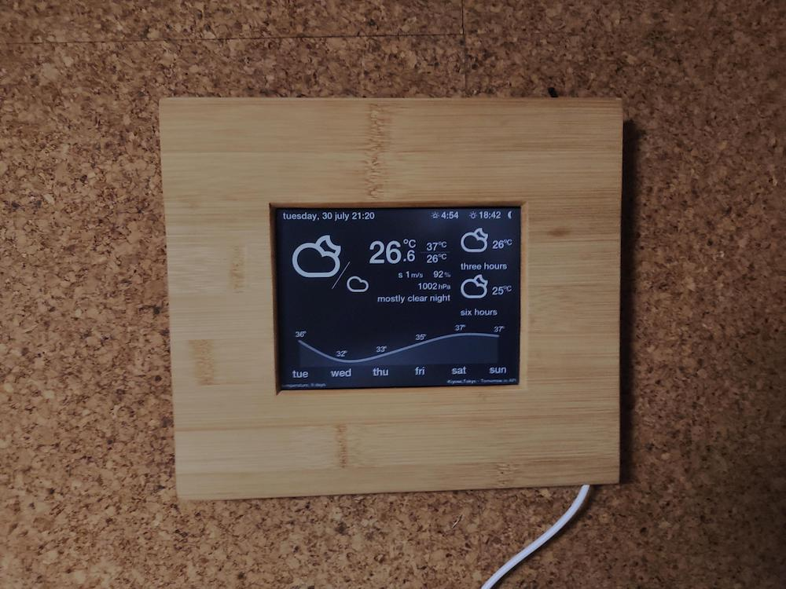
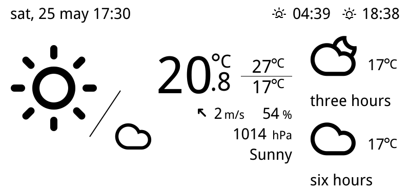
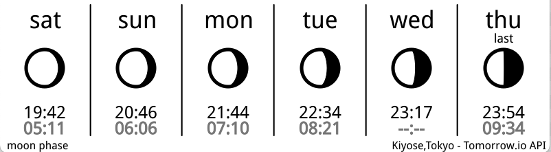
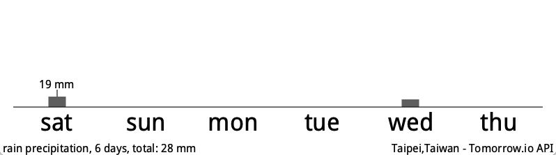
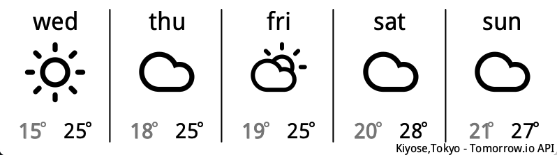
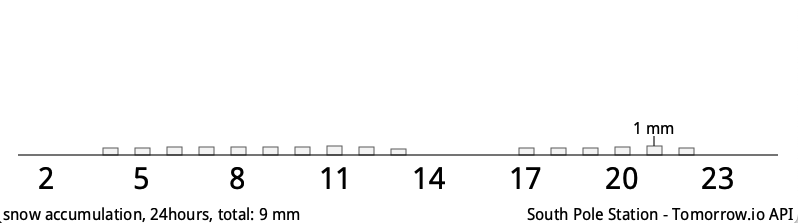
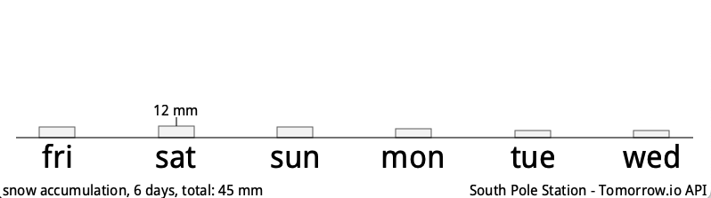

# Kindle Weather Display lite

This program is for a weather display on old Kindle 3 and Paperwhite 1 based on the original work by [Kindle-weather-station](https://gitlab.com/iero/Kindle-weather-station)

## Weather API

Following API is available:

- [Tomorrow.io](https://www.tomorrow.io/) (Free Tier)
  - Hourly forecast for 120 hours
  - Daily forecast for 6 days
 
## Screenshots

<kbd></kbd>&nbsp;

<kbd></kbd>&nbsp;

## Requirements

- Jailbroken Kindle: https://wiki.mobileread.com/wiki/Kindle\_Hacks\_Information

## Set up server

### 1. Install the program

Copy `(github)/kindle/kindle-weather-station` to `(kindle)/mnt/us/kindle-weather-station-lite`.

### 2. Set up user account

In config directory, edit `tomorrow_io_API_KEY.json`

### 3. Edit config files

Tempalate's names are `setting_*.json`.

Default config is `setting.json`.


### 4. Install Graphics converters, Python3 and modules.

#### Applications

- imageMagick (include in pythgon3 packgage)
- cairo (system) and cairosvg

#### Python3(v3.11 or newer) and module Requirements

- tzdata
- requests
- setuptools
- pip
- Wand
- cairosvg
- hijridate (optional, for moon\_phase module)


### 5. Network Time Synchronization

To retrieve data correctly, setup NTP server.

### 6. Test run

All set up finished, then try it.

`. ./env_pw1; ./weather.py png` # use default config

or one of config files:

`. ./env_pw1; ./weather.py setting_######.json png`

Take a look at `/tmp/KindleStation_flatten.png`.


```
                LOCAL NETWORK               USB NETWORK			
                e.g.(192.168.1.0/24).        192.168.1.XX/24(wifi)
 WAN <-> ROUTER <--------------> PC <------> KINDLE
                          192.168.15.1/24    192.168.15.244/24(fix)
		
```

When usbnet setup is finished, access to Kindle. 

```
ssh root@192.168.15.244
```

### 2. Setting up ssh Auth key

- Create the server's pubkey.
- Set up the server's ssh client environment.
- Copy the server's ssh pubkey to Kindle.

e.g.) dropbear (openwrt)

```
cd /etc/dropbear
dropbearkey -y -f dropbear_rsa_host_key | grep "^ssh-rsa " > dropbear_rsa_host_key.pub
mkdir /root/.ssh
cd /root/.ssh
ln -s /etc/dropbear/dropbear_rsa_host_key id_dropbear
cd -
scp dropbear_rsa_host_key.pub root@192.168.2.2:/tmp
ssh root@192.168.15.244  # access to Kindle
cat /tmp/dropbear_rsa_host_key.pub >> /mnt/us/usbnet/etc/authorized_keys
exit
ssh root@192.168.15.244  # test passwordless login
```

e.g.) openssh (openwrt)

```
cd /root/.ssh
opkg update
opkg install openssh-client openssh-keygen openssh-sftp-client
ssh-keygen -t rsa
scp id.pub root@192.168.2.2:/tmp
ssh root@192.168.15.244  # access to Kindle
cat /tmp/id.pub >> /mnt/us/usbnet/etc/authorized_keys
exit
ssh root@192.168.15.244  # test passwordless login
```

### 3. Test run

```
cd /opt/lib/kindle-weather-station
. ./env_pw1
./weather.py [config.json]
```

## Layout
Kindle display size is 600 x 800.
The program's layout is as follows:

| Module name       | Function                   | Size (Y-axis) |
|:------------------|:---------------------------|--------------:|
| maintenant        | Time information           | 40            |
| main              | Current and hourly weather | 480           |
| graph             | Graph  or tile             | 120           |
| daily_xlabel      | Label on daily weather     | 20            |
| hourly_xlabel     | Label on hourly weather    | 20            |
| padding[-+0-9]*   | Insert spaces (Y axis only)|               |


### 1. maintenant

<kbd></kbd>&nbsp;

- date
- sunrise
- sunset
- moonphase

### 2. main

<kbd></kbd>&nbsp;

- config
  - "timezone": "Pacific/Auckland" # UNIX zoneinfo
  - "encoding": "iso-8859-1"  # encoding name
  - "locale": "en_US.UTF-8"  # locale name
  - "lat": "-77.8400829"  # latitude
  - "lon": "166.6445298"  # longitude
  - "units": "metric" # options: metric, imperial
  - "lang": "en" # language: en (English)
  - "darkmode": "True", "False" and "Auto"( Note: To enable on openwrt, add `"system": "openwrt"`)	
  
#### 2.1 Value in cloud icon

<kbd></kbd>&nbsp;

- config
  - "in_clouds". : Value from 0 to 1.0 (0% to 100%)
     - "probability" : Probability of precipitation
     - "cloudCover" : Cloud thickness
     - "(empty)" : None

     
### 3. graph and tile

Available options are as follows:

- config: "graph\_objects"
  - "daily\_temperature": Daily Temperature
  - "daily\_rain\_precipitation": Daily Rain Precipitation
  - "daily\_snow\_accumulation": Daily Snow Accumulation
  - "daily\_weather": Daily Weather
  - "hourly\_temperature": Hourly Temperature
  - "hourly\_rain\_precipitation": Hourly Rain Precipitation
  - "hourly\_snow\_accumulation": Hourly Snow Accumulation 
  - "moon\_phase": Moon Phase


#### 3.1 spline graph 

<kbd></kbd>&nbsp;

- config
  - "graph\_objects": ["daily\_temperature\_spline\_landscape"]

    

#### 3.3 Moon Phase

<kbd></kbd>&nbsp;

- config
  - "graph\_objects": [ "moon\_phase\_landscape"]
  - "ramadhan": "True"

#### 3.4 Hourly Precipitation

<kbd></kbd>&nbsp;

- config
  - "graph\_objects": [ "hourly\_precipitation"]

#### 3.5 daily Precipitation

<kbd></kbd>&nbsp;

- config
  - "graph\_objects": [ "daily\_rain\_precipitation\_6cols"]

  
#### 3.6 daily weather

<kbd></kbd>&nbsp;

- config
  - "graph\_objects": [ "daily\_weather\_landscape"]


#### 3.7 hourly snow accumulation

<kbd></kbd>&nbsp;

- config
  - "graph\_objects": [ "hourly\_snow\_accumulation"]


#### 3.7 daily snow accumulation

<kbd></kbd>&nbsp;

- config
  - "graph\_objects": [ "daily\_snow\_accumulation\_6cols"]

    
## Setting up time schedule

Edit crontab and restart cron.

e.g.)

`/etc/crontab/root`

```
0 */2 * * * sh -c "cd /mnt/us/kindle-weather-station-lite; . ./env_pw1; ./weather.py 2>>/tmp/kindle-weather-station.err"
0 1,3,5,7,9,11,13,15,17,19,21,23 * * * sh -c "cd /mnt/us/weather-station-lite; . ./env_pw1; ./kindle-weather.py 2>>/tmp/kindle-weather-station.err"
```

```
kill -HUP `pidof crond`
```

# Credits

- [Tomorrow.io](https://www.tomorrow.io/) , Weather API
- [Bézier curves formula](https://www.particleincell.com/2012/bezier-splines/)